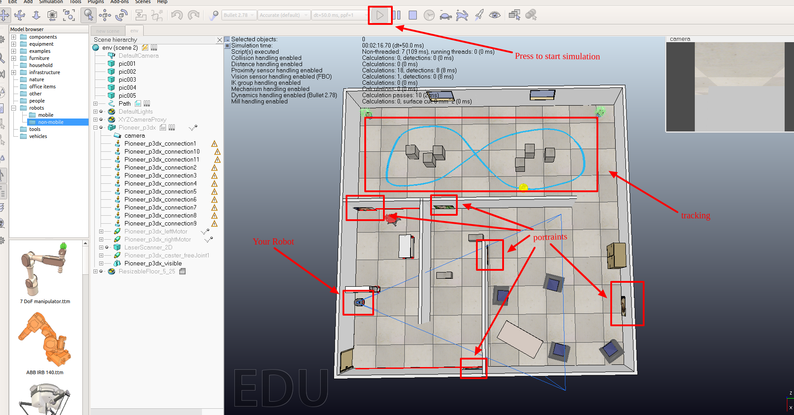

# Course Project Tutorial: IPR

**Notice**:

You are recommended to read the project description first to understand the general task before reading this tutorial.

**Also Notice**:

You are recommended to have some knowledges with ROS through the beginner level of [ROS tutorial](http://wiki.ros.org/ROS/Tutorials).

We have also uploaded a python-ROS example on gaussian process to help you familiar with ROS. [ex_gaussian_process](https://github.com/ramlab-ipr-project/example_gaussian_process)

